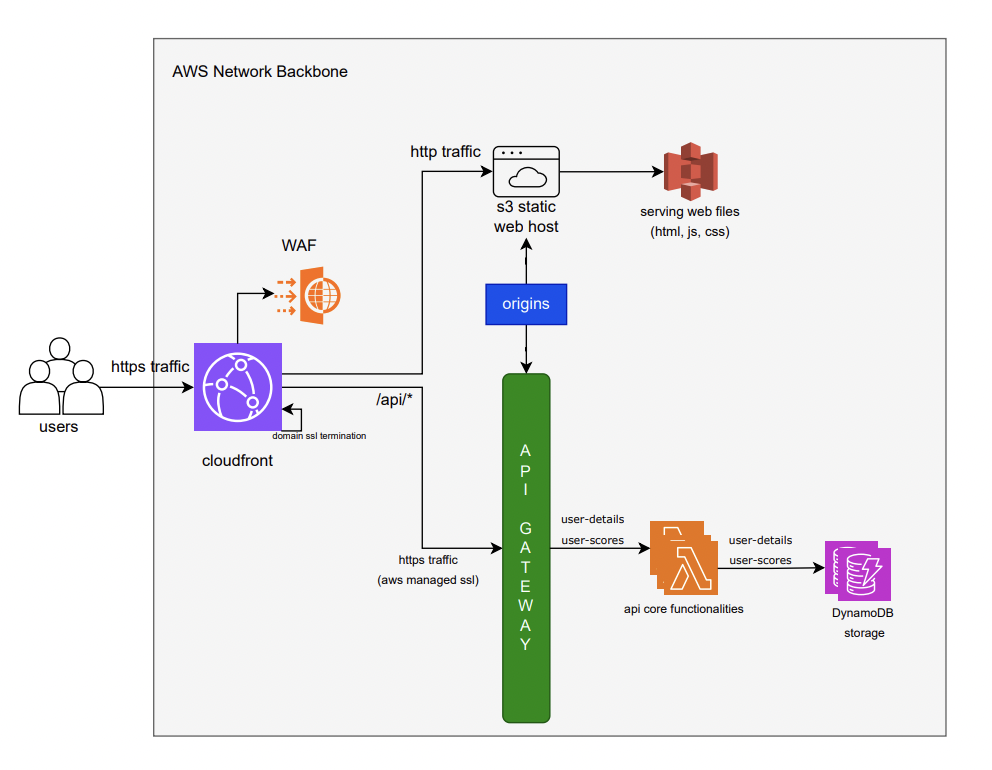

    <h1>
      TypeFaster - Test your typing skills and improve it!
    </h1>

    <h2> Preliminary Design </h2>
    

        
 Interaction view | HLD 

        

            
        

        

            <h3>Components Involved</h3>
            <ul>
                <li>
                    <h3>CloudFront</h3>
                    

                        Type: CDN Network
                    

                    

                        Usage Pattern:
                        <ol>
                            <li>
                                Cloudfront will serve both the FE and BE since it's a same domain request (need not handle CORS separately)
                            </li>
                            <li>
                                Although it's a lower user-traffic website, Cloudfront can still help in caching the static web contents (served via S3)
                            </li>
                            <li>
                                Can speed up the TRT after hitting nearby Edge location and the entire interaction then is carried over the AWS internal network backbone (not via Internet)
                            </li>
                        </ol>
                    

                </li>
                <li>
                    <h3>Lambda</h3>
                    

                        Type: Serverless Compute
                    

                    

                        Usage Pattern:
                        <ol>
                            <li>
                                Need for serverless compute since it's a low-scale app (and no requirement to run compute layer - 24 x 7). Also there is no requirement for Autoscale though Lambda can handle the same.
                            </li>
                            <li>
                                Lambda offers Always free-tier (for 1st 1 million requests / month) which is Safe to user rather using compute services like EC2. Hence this will be highly cost-bounded.
                            </li>
                            <li>
                                No need to manage the Infra since AWS runs the provided execution very quickly over the pre-warm nodes (managed internally)
                            </li>
                        </ol>
                    

                </li>
            </ul>
        

    

